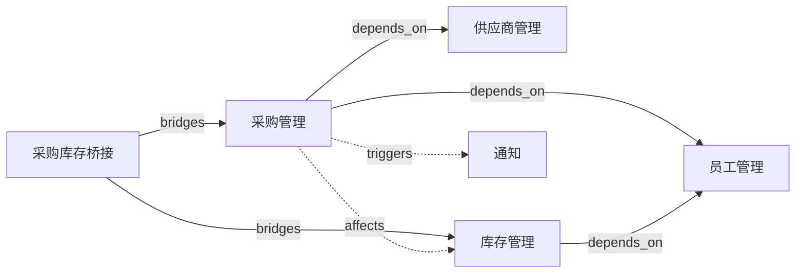

# 关系模型与语义图谱设计规范

## 1. 定位

关系是一等公民。没有关系，AI 看到的只是一堆孤立的表和接口。有关系，AI 才能看到业务网络、依赖网络、影响范围。

## 2. 三层关系

### 2.1 结构关系（已实现）

在 Schema 的字段定义中：

| 字段类型 | 关系 |
|----------|------|
| `ref` | 多对一 |
| `has_many` | 一对多 |
| `many_to_many` | 多对多 |

服务于：数据结构、持久化、查询、GraphQL 关联。

### 2.2 语义关系（本文档重点）

描述 Capability/Schema 之间的业务含义关系。

**大部分自动推断，少量手动补充。**

#### 自动推断来源

| 来源 | 推断出的关系 |
|------|------------|
| `capability.ts` dependencies | `depends_on` |
| Schema 的 `ref` / `has_many` | `contains` / `references` |
| Bridge 定义 | `bridges` / `affects` |
| EventHandler 跨模块监听 | `triggers` / `affects` |
| Flow 跨模块 Action 调用 | `orchestrates` |
| Rule 跨模块 Context 查询 | `reads_from` |

框架在启动时自动扫描所有 Capability，生成完整的关系图。

#### 手动补充

只有框架推断不出来的隐含关系才需要手动定义：

```typescript
import { defineRelation } from '@linchkit/core'

export const leaveConflictsProject = defineRelation({
  type: 'conflicts_with',
  from: { capability: 'hr_management', schema: 'leave_request' },
  to: { capability: 'project_management', schema: 'project' },
  description: '请假可能与紧急项目冲突',
  // 这个关系是业务语义，框架无法自动推断
})
```

### 2.3 语义关系类型

| 类型 | 含义 | 自动推断 |
|------|------|:---:|
| `depends_on` | A 依赖 B 存在 | ✅ 从 dependencies |
| `contains` | A 包含 B | ✅ 从 has_many |
| `references` | A 引用 B | ✅ 从 ref |
| `affects` | A 的变化影响 B | ✅ 从 Bridge/EventHandler |
| `triggers` | A 触发 B | ✅ 从 EventHandler |
| `orchestrates` | A 编排 B | ✅ 从 Flow |
| `reads_from` | A 读取 B 的数据 | ✅ 从 Rule Context |
| `conflicts_with` | A 和 B 有冲突约束 | ❌ 需手动 |
| `replaces` | A 替代 B | ❌ 需手动 |
| `derived_from` | A 从 B 派生 | ❌ 需手动 |

### 2.4 RAG / 检索关系（M3+）

服务于 AI 的文档检索和上下文增强：

- 文档关联（Capability 文档、变更说明）
- 历史案例（类似的 Proposal、类似的错误）
- 规则说明（为什么有这条 Rule）

M0-M2 不做，M3+ 视需要引入向量检索。

## 3. 关系图的用途

### 3.1 AI 理解系统

自动生成的 CLAUDE.md 中包含关系图描述：

```markdown
## 系统关系图

purchase_management
  ├── depends_on: employee_management, supplier_management
  ├── affects: inventory_management (via purchase_inventory_bridge)
  └── triggers: notification (via EventHandler)

inventory_management
  ├── depends_on: employee_management
  └── reads_from: purchase_management (via Rule Context)
```

### 3.2 Proposal 影响分析

创建 Proposal 时，框架根据关系图自动分析影响范围：

```
Proposal: 修改 purchase_request 的 amount 字段
    ↓
关系图分析：
  - purchase_request.amount 被 Rule amount_check 使用
  - purchase_request affects inventory_management
  - purchase_inventory_bridge 监听 purchase_request 事件
    ↓
影响报告：
  - 直接影响：amount_check Rule
  - 间接影响：inventory_management（通过 bridge）
  - 建议检查：bridge 中的金额相关逻辑
```

### 3.3 系统地图（自动生成 Mermaid）

框架自动将关系图生成 Mermaid 格式，嵌入 CLAUDE.md 和 Capability Spec：



- AI 可读（Mermaid 语法对 LLM 友好）
- 人可读（Markdown 渲染成图）
- 每次部署后自动更新
- 也可以生成单个 Capability 的关系子图

## 4. 与里程碑的关系

### M0
- 结构关系（Schema ref/has_many）
- 自动推断基础关系图（dependencies）

### M1
- 完整自动推断（Bridge/EventHandler/Flow/Rule Context）
- 手动补充关系
- Proposal 影响分析

### M2
- 关系图可视化
- CLAUDE.md 中包含关系描述

### M3+
- RAG / 检索关系
- 向量检索
